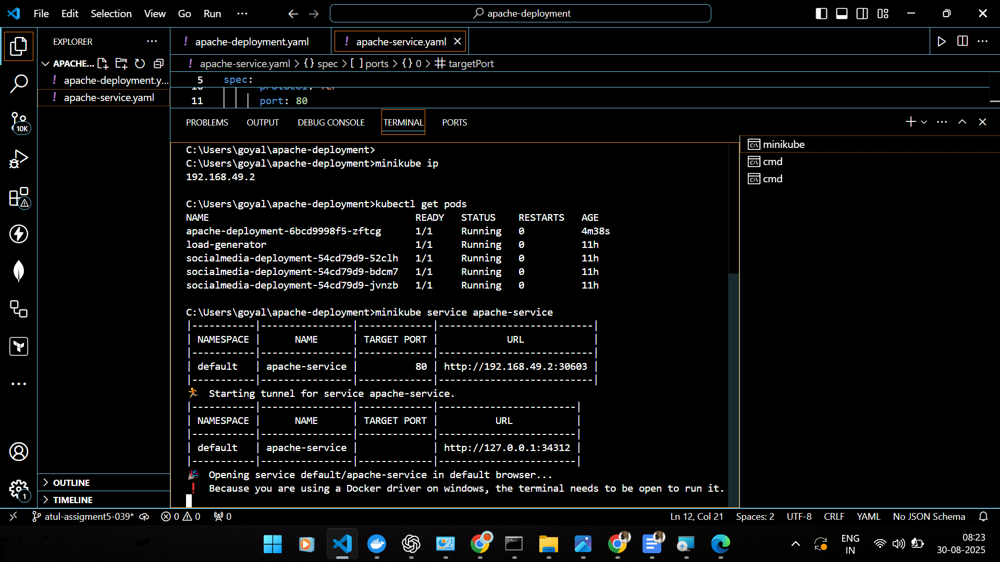
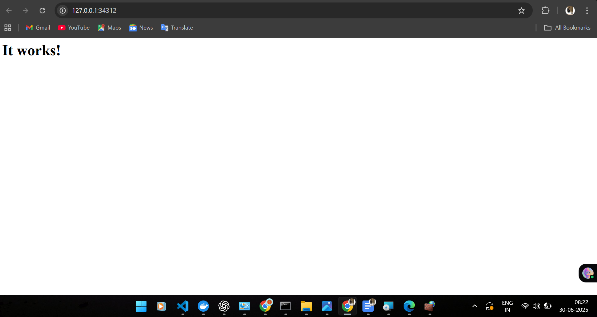
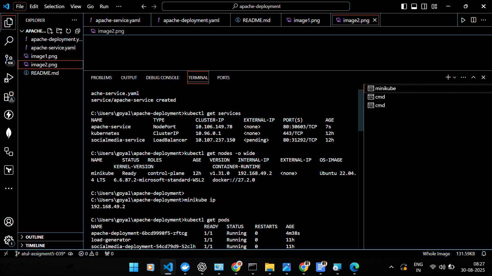

# Minikube Apache Service

This project demonstrates how to deploy a simple Apache web server to a local Kubernetes cluster using Minikube on Windows. It includes a basic `Deployment` and a `NodePort` Service to expose the web server.

## Prerequisites

* **Minikube:** A tool that runs a single-node Kubernetes cluster on your local machine.

* **kubectl:** The command-line tool for interacting with your Kubernetes cluster.

* **Docker Desktop** (or another compatible container/VM manager): Required by Minikube to create the virtual machine that hosts the cluster.

## Deployment Steps

1.  **Start Minikube:**
    Open your terminal and start the Minikube cluster. This command will also download the necessary Kubernetes image and set up the cluster environment.

    ```
    minikube start

    ```

2.  **Create the Apache Deployment:**
    Use `kubectl` to create a new deployment named `apache-deployment` using the `httpd` Docker image. This command tells Kubernetes to run three replicas of the Apache server.

    ```
    kubectl create deployment apache-deployment --image=httpd --replicas=3

    ```

3.  **Create the Service:**
    Next, create a `NodePort` service to expose the Apache deployment. The `NodePort` service type makes the service accessible from outside the cluster on a static port on each node.

    ```
    kubectl expose deployment apache-deployment --type=NodePort --port=80

    ```

    This command will automatically assign a `NodePort` in the range of `30000-32767`. You can find the assigned port with the following command:

    ```
    kubectl get service apache-deployment

    ```

4.  **Access the Service:**
    To access the web server, you need to find the Minikube IP address and the `NodePort` assigned to your service.

    * Get the Minikube IP address:

        ```
        minikube ip

        ```

    * Get the service URL:

        ```
        minikube service apache-deployment --url

        ```

5.  **Troubleshooting (Windows)**
    If you are on Windows and cannot access the service directly using the Minikube IP, it is likely a network issue related to the Docker Desktop driver. To fix this, you must run `minikube tunnel` in a separate, administrative terminal window.

    ```
    minikube tunnel

    ```

    Keep this terminal window open. You should now be able to access the service using the URL from step 4.

## Final Result

Once all the steps are complete and the service is accessible, you should be able to view the default Apache welcome page in your web browser.


